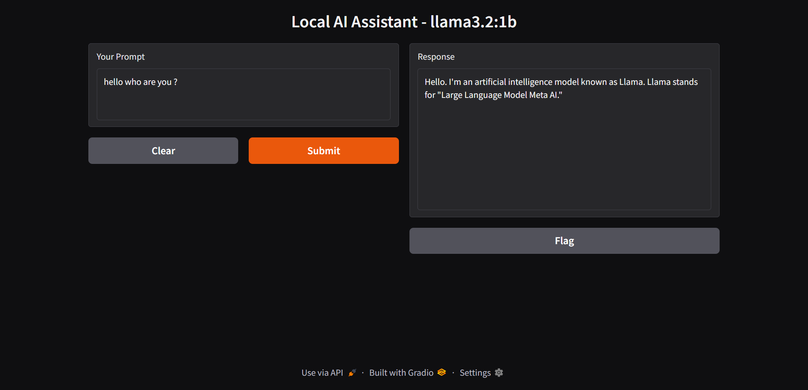

# Local AI Assistant (Gradio + Ollama)

A simple Gradio chat app that sends prompts to a local Ollama model and returns responses.



## Project Structure

- `app/main.py` - Gradio interface and Ollama chat function
- `requirements.txt` - Python dependencies

## Requirements

- Python 3.10+
- Ollama installed and running
- A local Ollama model (default in this app: `llama3.2:1b`)

## Setup

1. Install Python dependencies:

```bash
pip install -r requirements.txt
```

2. Make sure the model exists locally (if needed):

```bash
ollama pull llama3.2:1b
```

## Run

```bash
python app/main.py
```

Then open the local Gradio URL shown in your terminal.

## Optional: Use a Different Model

Set an environment variable before running the app.

PowerShell:

```powershell
$env:OLLAMA_MODEL="llama3.2:1b"
python app/main.py
```

If the selected model is missing, the app shows a message with the exact `ollama pull` command to run.
